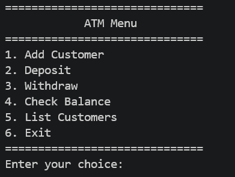
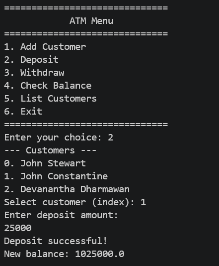
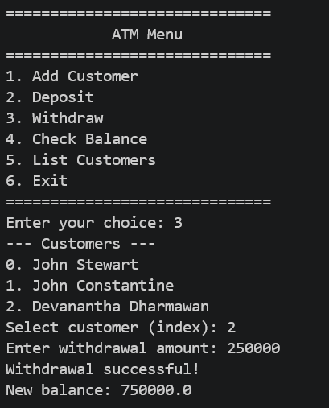
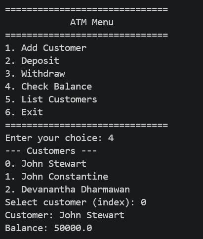
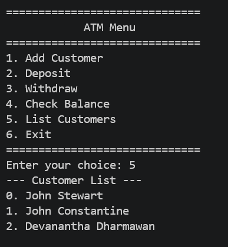

Name: Made Agastya Devanatha Dharmawan

NIM: F1D02410071  

# OOP Assignment - Array and ArrayList

A simple console-based **ATM Banking System** built in Java that demonstrates Object-Oriented Programming concepts such as encapsulation, classes, and the use of arrays to manage customer data.

## Project Structure

- `src/` — Java source files
  - `App.java` — Main application with ATM menu loop
  - `Bank.java` — Manages an array of `Customer` objects (max 10)
  - `Customer.java` — Stores customer first/last name and their `Account`
  - `Account.java` — Handles balance, deposit, and withdrawal logic
- `img/` — Screenshots demonstrating program output
- `bin/` — Compiled `.class` files

## Features

| # | Feature | Description |
|---|---------|-------------|
| 1 | Add Customer | Register a new customer with first name, last name, and initial balance |
| 2 | Deposit | Deposit money into a selected customer's account |
| 3 | Withdraw | Withdraw money from a selected customer's account (with balance validation) |
| 4 | Check Balance | View the current balance of a selected customer |
| 5 | List Customers | Display all registered customers |
| 6 | Exit | Terminate the program |

The program initializes with two default customers:
- **John Stewart** — initial balance: 50,000.00
- **John Constantine** — initial balance: 1,000,000.00

---

## Screenshots & Explanation

### 1. ATM Main Menu


When the program starts, the ATM main menu is displayed. It presents 6 options to the user: Add Customer, Deposit, Withdraw, Check Balance, List Customers, and Exit. The user is prompted to enter a number (1–6) to select an action. This menu is shown repeatedly in a loop until the user chooses option 6 to exit.

---

### 2. Add Customer (Option 1)


The user selects option **1** to add a new customer. The program prompts for a **first name** (`Devanantha`), a **last name** (`Dharmawan`), and an **initial balance** (`1000000`). After the input is complete, the new customer is stored in the `Bank`'s customer array and the message `"Customer added successfully!"` is printed to confirm the registration.

---

### 3. Deposit (Option 2)


The user selects option **2** to make a deposit. The program first displays the list of all customers with their index numbers (0. John Stewart, 1. John Constantine, 2. Devanantha Dharmawan). The user selects customer index **1** (John Constantine) and enters a deposit amount of **25,000**. The deposit is processed successfully, and the new balance is displayed as **1,025,000.0** (previous 1,000,000 + 25,000 deposit).

---

### 4. Withdraw (Option 3)


The user selects option **3** to make a withdrawal. The customer list is displayed, and the user selects customer index **2** (Devanantha Dharmawan). A withdrawal amount of **250,000** is entered. Since the account has sufficient balance (1,000,000), the withdrawal succeeds, and the new balance is shown as **750,000.0** (previous 1,000,000 − 250,000 withdrawal).

---

### 5. Check Balance (Option 4)


The user selects option **4** to check a customer's balance. After the customer list is shown, the user selects customer index **0** (John Stewart). The program displays the customer's full name and their current account balance of **50,000.0**, which remains unchanged since no deposit or withdrawal was made on this account.

---

### 6. List Customers (Option 5)


The user selects option **5** to view all registered customers. The program prints the full customer list under the header `"--- Customer List ---"`, showing each customer with their index: 0. John Stewart, 1. John Constantine, and 2. Devanantha Dharmawan (the newly added customer from earlier).

---

## How to Run

1. Compile the source files:
   ```bash
   javac -d bin src/*.java
   ```
2. Run the application:
   ```bash
   java -cp bin App
   ```
