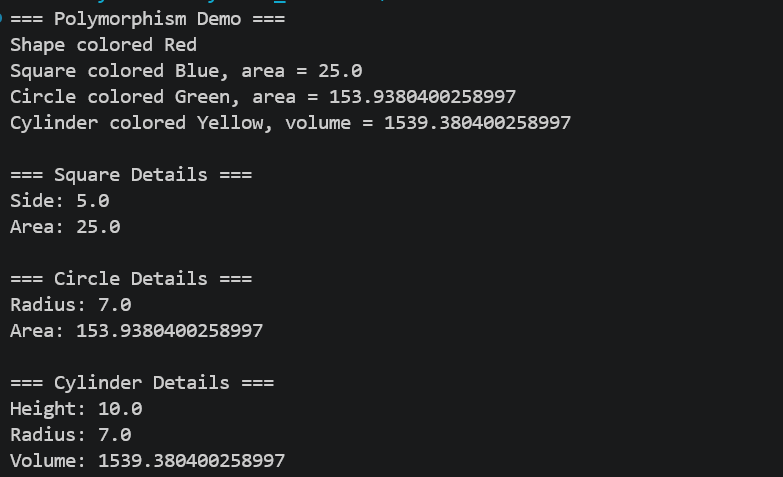

Name: Made Agastya Devanatha Dharmawan

NIM: F1D02410071  


# Inheritance and Polymorphism

A Java program demonstrating the concepts of **Encapsulation**, **Inheritance**, and **Polymorphism** using a geometric shape class hierarchy.

## Class Structure

```
Shape (superclass)
├── Square extends Shape
├── Circle extends Shape
│   └── Cylinder extends Circle
```

| Class | File | Description |
|-------|------|-----------|
| `Shape` | `src/Shape.java` | Base class with `color` attribute |
| `Square` | `src/Square.java` | Square, derived from `Shape` |
| `Circle` | `src/Circle.java` | Circle, derived from `Shape` |
| `Cylinder` | `src/Cylinder.java` | Cylinder, derived from `Circle` |
| `Main` | `src/Main.java` | Main class to run the program |

---

## 1. Encapsulation

Encapsulation is the concept of hiding the internal details of an object and only providing access through public methods (getters/setters).

### Examples in code:

- **`Square.java`** — the `side` attribute is declared `private`, and can only be accessed through `getSide()` and `setSide()`:
  ```java
  private double side;          // hidden from outside the class

  public double getSide() {     // getter to access side value
      return side;
  }

  public void setSide(double side) {  // setter to modify side value
      this.side = side;
  }
  ```

- **`Circle.java`** — the `radius` attribute is declared `private`, accessed via `getRadius()` and `setRadius()`:
  ```java
  private double radius;

  public double getRadius() { return radius; }
  public void setRadius(double radius) { this.radius = radius; }
  ```

- **`Cylinder.java`** — the `height` attribute is declared `private`, accessed via `getHeight()` and `setHeight()`:
  ```java
  private double height;

  public double getHeight() { return height; }
  public void setHeight(double height) { this.height = height; }
  ```

With encapsulation, the internal data of objects is protected and can only be modified through defined methods.

---

## 2. Inheritance

Inheritance is the concept where a class (subclass) inherits attributes and methods from another class (superclass) using the `extends` keyword.

### Examples in code:

- **`Square extends Shape`** — inherits the `color` attribute as well as the `getColor()` and `setColor()` methods from the `Shape` class:
  ```java
  public class Square extends Shape {
      public Square(double side, String color) {
          super(color);  // calls the superclass Shape's constructor
          this.side = side;
      }
  }
  ```

- **`Circle extends Shape`** — also inherits attributes and methods from `Shape`:
  ```java
  public class Circle extends Shape {
      public Circle(double radius, String color) {
          super(color);  // calls the superclass Shape's constructor
          this.radius = radius;
      }
  }
  ```

- **`Cylinder extends Circle`** — inherits from `Circle`, which means it also inherits from `Shape` (multi-level inheritance). The Cylinder can use `getRadius()`, `getColor()`, and `calculateArea()` from its parent classes:
  ```java
  public class Cylinder extends Circle {
      public Cylinder(double height, double radius, String color) {
          super(radius, color);  // calls the Circle's constructor
          this.height = height;
      }

      public double calculateVolume() {
          return calculateArea() * height;  // uses calculateArea() from Circle
      }
  }
  ```

---

## 3. Polymorphism

Polymorphism is the concept where the same method (`printInfo()`) has different behaviors depending on the object that calls it. This is achieved with **method overriding** (`@Override`).

### Examples in code:

Each subclass overrides the `printInfo()` method from the `Shape` class:

| Class | Output `printInfo()` |
|-------|---------------------|
| `Shape` | `"Shape colored [color]"` |
| `Square` | `"Square colored [color], area = [area]"` |
| `Circle` | `"Circle colored [color], area = [area]"` |
| `Cylinder` | `"Cylinder colored [color], volume = [volume]"` |

In **`Main.java`**, polymorphism is demonstrated by storing all objects in an array of type `Shape` and calling `printInfo()` — Java automatically executes the method version corresponding to the actual object type:

```java
Shape[] shapes = {shape, square, circle, cylinder};
for (Shape s : shapes) {
    s.printInfo();  // the called method depends on the actual object type
}
```

## Screenshots & Explanation


Even though the variable `s` is of type `Shape`, the executed `printInfo()` method belongs to each subclass respectively — this is **runtime polymorphism**.

---

## How to Run

```bash
javac -d bin src/*.java
java -cp bin Main
```
