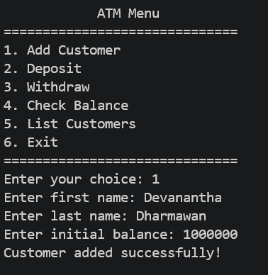

Name: Made Agastya Devanatha Dharmawan

NIM: F1D02410071  

## Folder Structure

The workspace contains two folders by default, where:

- `src`: the folder to maintain sources
- `lib`: the folder to maintain dependencies
- `img`: the folder of output screenshots

## Program Demo
### 1. Main Menu

### 2. Add Costumer (Menu 2)

### 3. Deposit (Menu 3)

### 4. Withdraw (Menu 4)

### 5. Check Balance (Menu 5)

### 6. Detail Customer (Menu 6)

